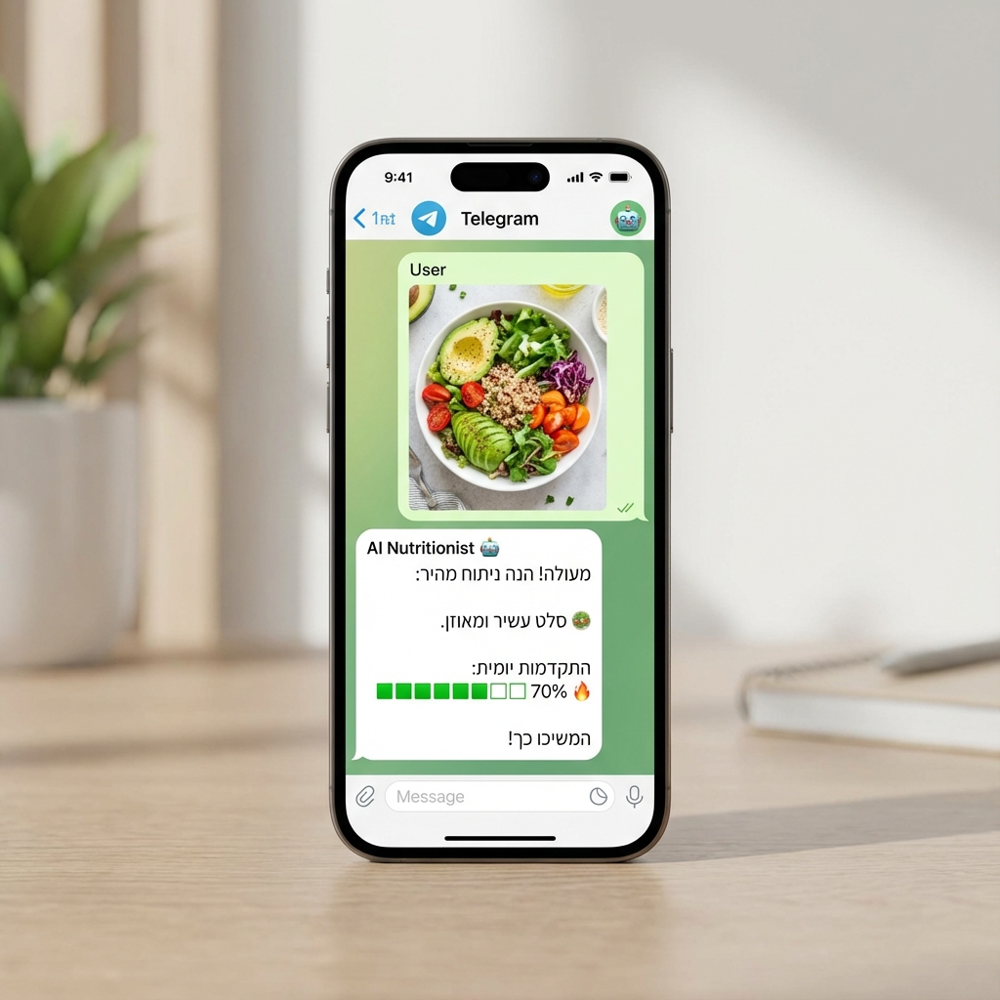

<div align="center">


# 🥗 Hebrew AI Nutritionist Bot (Noga)

**Your Personal AI Nutritionist & Fitness Coach on Telegram**

[](https://www.typescriptlang.org/)
[](https://nodejs.org/)
[](https://www.docker.com/)
[](https://deepmind.google/technologies/gemini/)
[](https://n8n.io/)

</div>

---

## 🌟 Overview

**Noga (AI Nutritionist)** is an advanced Telegram bot designed to help Hebrew speakers track their nutrition, achieve fitness goals, and maintain a healthy lifestyle. Unlike simple calorie counters, Noga uses **Google Gemini AI** to "see" your food, understand your natural language, and provide personalized, empathetic feedback like a real coach.



## ✨ Key Features

-   **📸 Visual Food Analysis**: Simply send a photo of your meal! The AI identifies ingredients, estimates portions, and logs calories/macros automatically.
-   **💬 Natural Hebrew Conversation**: Chat with Noga naturally. Tell her "I ate a shawarma in a laffa" or "I'm feeling tired today", and she'll understand the context.
-   **🚀 Smart Onboarding**: New users are guided through a friendly setup process to calculate their BMR and daily goals based on age, weight, height, and activity level.
-   **📊 Visual Progress Tracking**: Get beautiful summaries with progress bars for Calories, Protein, Carbs, and Fats after every meal.
-   **🧠 Empathetic Coaching**: Noga has a personality! She encourages you, gently warns you about limits, and celebrates your wins.
-   **💾 Persistent Memory**: Remembers your history, stats, and preferences using a local SQLite database.

## 🛠️ Tech Stack

*   **Backend**: Node.js & TypeScript
*   **AI Model**: Google Gemini 1.5/2.5 Flash (via Google GenAI SDK)
*   **Database**: SQLite (Simple & persistent)
*   **Automation**: n8n (Handles Telegram webhooks & media routing)
*   **Deployment**: Docker & Docker Compose

## 🚀 Getting Started

### Prerequisites
*   [Docker](https://www.docker.com/) & Docker Compose
*   A Telegram Bot Token (from [@BotFather](https://t.me/BotFather))
*   A Google Gemini API Key (from [Google AI Studio](https://aistudio.google.com/))

### Installation

1.  **Clone the repository:**
    ```bash
    git clone https://github.com/LiwaaCoder/AI-Nutritionist.git
    cd AI-Nutritionist
    ```

2.  **Configure Environment:**
    Create a `.env.local` file in the root directory:
    ```env
    GEMINI_API_KEY=your_google_api_key_here
    API_KEY=your_google_api_key_here_backup
    ```

3.  **Run with Docker:**
    ```bash
    docker compose up -d
    ```
    This will start:
    *   `nutrition-bot` (The backend server on port 3000)
    *   `n8n` (The automation workflow on port 5678)

4.  **Configure n8n:**
    *   Open http://localhost:5678 in your browser.
    *   Set up the **Telegram Trigger** node with your Bot Token.
    *   Set up the **HTTP Request** node to send data to `http://nutrition-bot:3000/api/chat`.
    *   **Crucial for Images:** Ensure the `image` field in n8n is set to the binary data expression: `{{ $binary.data.data }}` (or equivalent based on your n8n version).

## 💡 Usage

1.  Open your bot in Telegram.
2.  Send any message to start.
3.  **Onboarding:** If it's your first time, Noga will ask for your details (Age, Weight, etc.).
4.  **Logging Food:** Just send a picture of your food or type "I ate an apple".
5.  **Check Status:** Ask "How much protein do I have left?" or "What did I eat today?".

## 🤝 Contributing

Contributions are welcome! Please feel free to submit a Pull Request.

## 📄 License

This project is open-source and available under the [MIT License](LICENSE).
